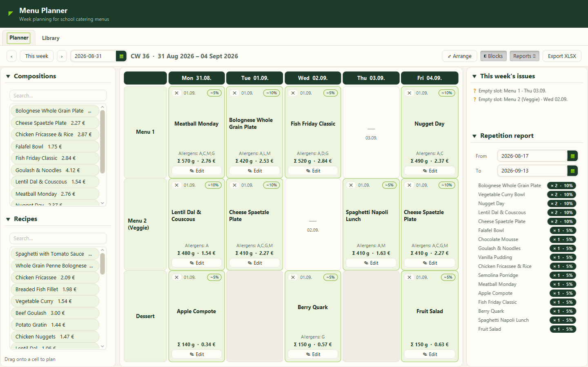
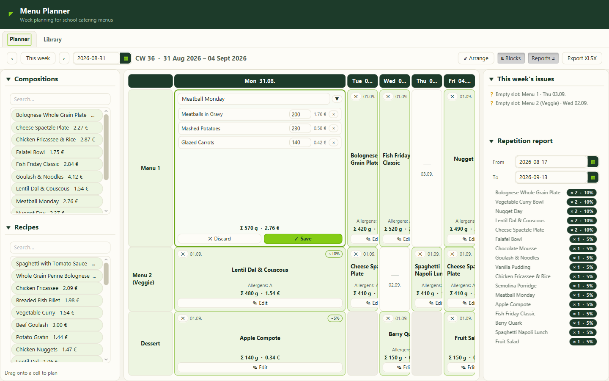
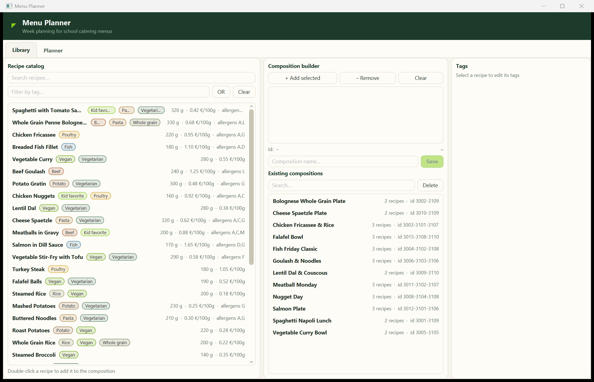

# Menu Planner

[](https://github.com/leon-b-the-g/Menu-Planner/actions/workflows/build.yml)

A JavaFX week planner for a school-catering kitchen: build menus from a recipe library,
drag them onto a slot × weekday grid, watch costs and allergens roll up live, and let the
built-in analytics warn you when the same meal shows up too often.

This is a portfolio rebuild of a production menu-planning module I designed and built for a
custom ERP system at a catering company serving Berlin schools. The original ships inside a
large proprietary codebase; this version reproduces the module's core workflow as a standalone
project — with a fresh visual design and a **fully synthetic recipe catalog** in place of the
company's recipe backend. No real company code, data or styling is included.



## The domain

Every service day the kitchen offers a fixed set of **slots** (Menu 1, a vegetarian Menu 2,
dessert on some days). A planned **menu** for a cell is assembled from **recipes** — either
directly or via reusable **compositions** ("Fish Friday Classic" = breaded fish + mashed
potatoes + cucumber salad). Each component carries a portion size in grams, a live ingredient
cost, and allergen codes that must be printed on the published plan.

## Features

**Planner tab**
- Week grid (slot rows × Mon–Fri) with per-slot day availability and week navigation
- **Resizable grid**: every column and row edge is draggable (all rows stay column-aligned
  via synced split dividers); **Arrange** resets to an even, legible layout
- **Focus-on-edit**: opening a cell's editor enlarges that cell's column and row so all of
  its text is readable; Save/Discard settles the grid back to the arranged layout
- **Collapsible panels**: each section (Compositions, Recipes, issues, repetition report)
  folds to its title, and the whole Blocks/Reports side panels can be hidden from the toolbar
- **Drag & drop** compositions or single recipes onto cells; a composition seeds the in-cell
  editor with its recipes as portion-editable components
- In-cell menu editor: grams per component, live cost per portion and per menu
  (Σ grams · Σ €), menu-name autocomplete over saved menus with a ▼ load action
- Saving **freezes a price snapshot** per component — the locked cell shows the frozen totals
  and the snapshot date, mirroring how the original separates live and contractual costs
- Locked cells show the menu name, the live allergen union, and a **similarity badge**:
  occurrences of that menu within the 4-week window centred on the day, over 20 delivery days
  (≥ 15 % renders as a warning)
- **Issues report** for the visible week: empty slots and high-similarity meals
- **Repetition report** over any date range: per-menu counts and share of delivery days
- **Excel export**: one sheet per week (slot rows × Mon–Fri), with per-component allergen
  codes regenerated at export time — the print must never repeat stale codes

**Library tab**
- Recipe catalog with search and **colored tag chips** (diet, cuisine, main component)
- Tag filter with autocomplete and a switchable **AND/OR** mode, active tags as removable chips
- Tag assignment per recipe (persisted)
- **Composition builder**: pick recipes, get the canonical composition id derived from the
  sorted recipe numbers, with **duplicate detection** before saving

The in-cell editor with the grid focused on the edited cell:





## Persistence

Plans, menus, compositions and tag assignments persist to `~/.menu-planner/plan.json`
(pretty-printed Jackson). On first launch the store is seeded with the synthetic catalog
plus two pre-planned weeks, so the grid, similarity badges and reports have content
immediately. Delete the file to reset.

## Architecture

```
com.chordata.menuplanner
├── MenuPlannerApp / Launcher       JavaFX bootstrap (Launcher enables the shaded jar)
├── controller
│   ├── MainController              Shell: tabs + cross-tab wiring
│   ├── LibraryController           Catalog, tag filter/assignment, composition builder
│   └── PlannerController           Week grid, drag & drop, cell editor, reports, export
├── model                           Recipe, Tag, Composition, Slot, MenuPart, PlannedMenu, CellKey
└── service                         (JavaFX-free, headlessly testable)
    ├── CatalogService              Synthetic recipe/tag/slot catalog
    ├── PlanRepository              In-memory store + JSON persistence + first-run seeding
    ├── AnalyticsService            Similarity scores + repetition report
    └── ExcelExportService          One-sheet-per-week XLSX (Apache POI)
```

The original module is a set of large JavaFX controllers wired directly to the ERP's data
layer; this rebuild separates domain, services and view logic so the analytics and export
are testable without a UI.

## Run it

### IntelliJ IDEA (recommended)

Open the project folder — IntelliJ imports the Maven project automatically. When prompted,
select any **JDK 21+** as the project SDK. Three shared run configurations are included:

| Configuration | What it does |
|---|---|
| **Planner (javafx:run)** | Builds and launches the app via the JavaFX Maven plugin |
| **Planner (direct)** | Runs the `Launcher` class straight from the IDE (fastest iteration) |
| **Package fat JAR** | Builds the self-contained `target/menu-planner-1.0.0.jar` |

### Command line

Requires JDK 21+. The Maven wrapper is included, so no Maven install is needed:

```bash
./mvnw javafx:run
```

Or build and run the self-contained fat jar:

```bash
./mvnw package
java -jar target/menu-planner-1.0.0.jar
```

## Tech stack

- Java 21, JavaFX 21 (FXML + CSS)
- Jackson (JSON persistence)
- Apache POI (XLSX export)
- Maven (javafx-maven-plugin, shade plugin)

## License

[MIT](LICENSE)
